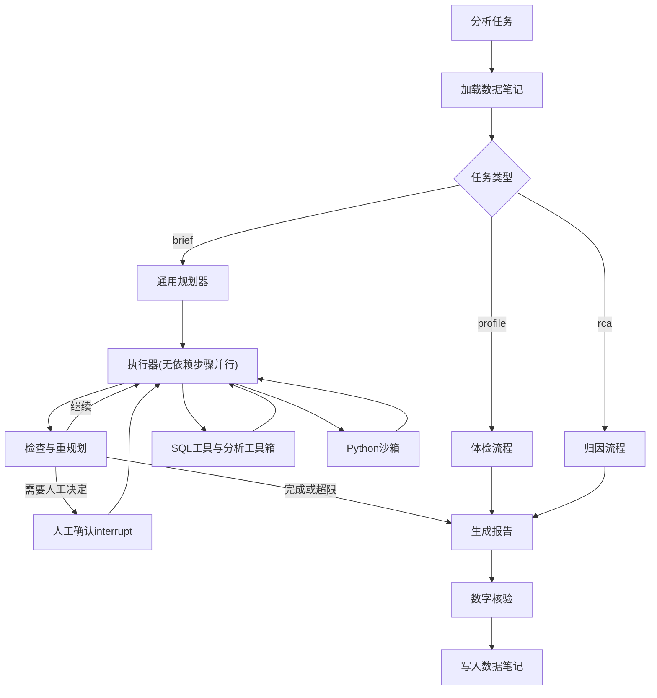
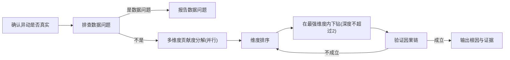
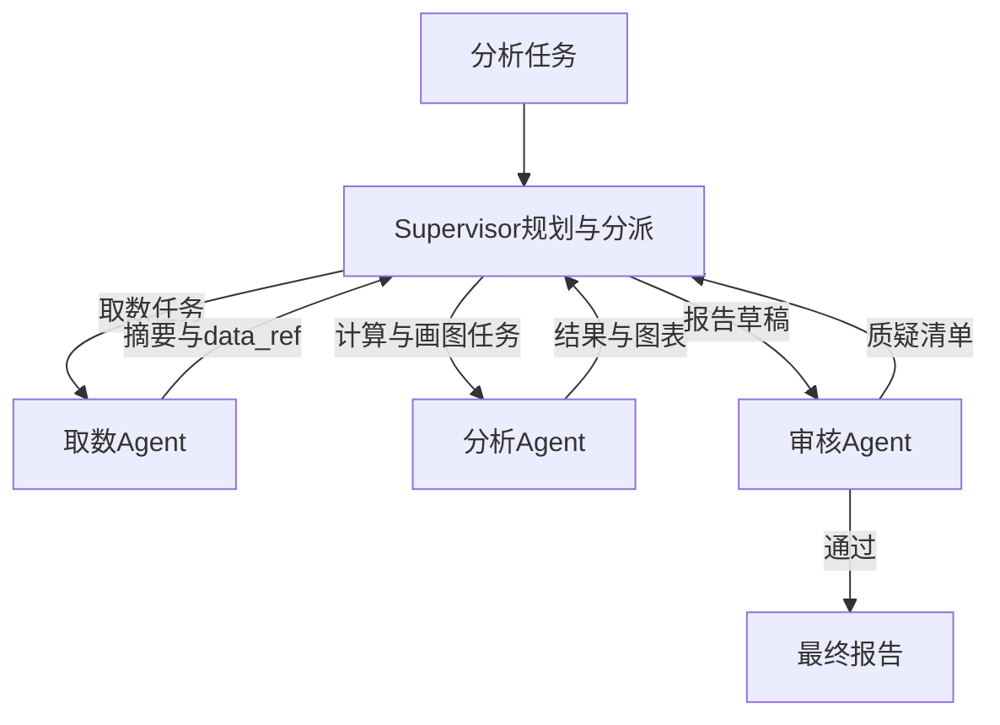

# 电商数据分析 Agent 十周路线（v4：任务驱动版）

## 零、给指导模型的说明（必读）

本文件是项目二唯一的权威计划（旧版本全部作废）。每次会话开始前，按顺序读完：本文件、项目二根目录的 `HANDOFF.md`、`docs/metrics.md`。

### 学员情况
- 大四学生，目标是 AI 应用或 Agent 开发实习。
- Python 基础一般，SQL 薄弱（第 1 周补），没写过 asyncio（第 6 周从零讲），没有数据分析经验（第 1、4、5 周通过亲手分析来学）。
- 已完成项目一（客服 Agentic RAG，路径 `d:\01_Study\09_agents\support-assistant`）。用过 DeepSeek（OpenAI 兼容接口）、LangGraph `StateGraph`、FastAPI、Streamlit、pytest 假 client。
- 每周约 20 小时。

### 最重要的原则：项目二不是项目一的翻版
学员明确要求项目二**不要套用项目一的样子**。指导模型必须遵守：
- 交互形态是"提交分析任务，拿到分析报告"，**不是**一问一答的聊天。
- 评测是"注入已知异常、复核真实现象、核验报告数字"，**不是**题库加标准答案算正确率。
- **不使用向量检索**。业务口径用一个小的 YAML 目录，通过别名匹配查询。
- 不照搬项目一的多轮改写、聊天界面、检索模块。只有 `llm_client` 的写法可以迁移（并且要改造）。

### 教学协议
1. 小步推进：一次讲一个概念，先给最小示例，让学员预测结果或写伪代码，再由学员自己写。
2. 每周"核心代码"清单由学员亲手写；样板代码（配置、compose、Dockerfile、建表 SQL、UI 拼装）可以直接给。
3. 每个模块讲完出 2 到 3 道口头问答题。
4. 回复简短，中文，先对齐下一步再改文件。
5. 不跳周。学员想偏离计划时，先说明影响再让他决定。
6. **严禁编造数字**。所有指标由脚本跑出，写入 `docs/metrics.md`，注明日期、commit、命令。
7. 会话结束前更新 `HANDOFF.md`。
8. **不要直接告诉学员数据有哪些坑**。第四节的"指导模型专用清单"只用于在学员自己摸底之后核对和补漏，要用提问引导他自己发现。

### 明确不做
- 不用 LangChain 的 `SQLDatabaseChain`、`create_sql_agent`、`create_react_agent`。LangGraph 只用 `StateGraph`、`Command`、`interrupt`、checkpointer。
- 第 8 周前不做多 Agent；多 Agent 手写，不用 `langgraph-supervisor`。
- 第 1 到第 5 周写同步代码，第 6 周统一改成异步。
- 不做向量检索、不做问答题库式评测、不做聊天界面。
- 不对业务数据做写操作（评测用的注入副本由独立的管理脚本生成，Agent 账号永远只读）。
- 不做登录鉴权与多租户、微调、Kubernetes、Kafka、Celery、前端炫技、葡萄牙语评论的重度 NLP。

### 决策记录（已确认，不要推翻）
- 数据：Olist 巴西电商真实数据，导入 PostgreSQL。
- 形态：三类分析任务（数据体检、指标异动归因、专题分析），输出结构化报告。
- 数据问题由 Agent 自己发现，不预先写进语义层；只保留少量**业务口径**定义供查询。
- 技术：PostgreSQL（只读账号 + 守卫）、Redis、asyncio、LangGraph、Python 沙箱、MCP；第 8 周多 Agent 并做对比实验。
- 周期 10 周。
- 项目一的检索升级（ES 混合检索、重排序）是另一份独立计划，与本项目无关。

## 一、项目定位

**一句话**：一个"初级数据分析师"Agent。你交给它一个分析任务，它自己摸清数据、制定分析计划、查询和计算、验证假设，最后交付一份每个数字都能追溯到数据的分析报告。

**三类任务**：
1. **数据体检**：只给数据库连接，不给任何说明。Agent 自己摸清有哪些表、表之间怎么关联、每张表一行代表什么、时间覆盖范围、数据质量问题（重复、缺失、JOIN 放大等），输出体检报告，并把发现写成"数据笔记"供后续任务使用。
2. **指标异动归因**：比如"2018 年 3 月差评率明显上升，找出原因"。Agent 先确认异动是否真实存在，再按品类、州、卖家、支付方式、配送时长等维度分解，计算每个维度的贡献度，逐层下钻，验证因果链，最后排出根因。它还要能识别"这不是业务问题，而是数据问题"。
3. **专题分析**：开放式任务，比如"评估东北部各州的物流体验并给出改进建议"。Agent 自己拆解问题、规划步骤、出报告。

**和项目一的区别（面试时的讲法）**：
- 项目一：用户问、系统答，核心是找对资料、说对话。
- 项目二：系统接任务、自己干，核心是在真实数据上做**多步探索、计算、验证和判断**。它要能发现数据本身的问题，能区分"真实变化"和"数据错误"，能用证据支撑每个结论。

**项目二要学的新能力**：
- 执行类工具与双层安全边界（第 2 周）
- 基于环境客观反馈的自修复（第 2 周）
- 自主数据探索与结构推断（第 3 周）
- "确定性工具负责算、模型负责决策"的 Agent 设计（第 3、4 周）
- 多步归因推理、假设验证、结构化可核验报告（第 4 周）
- 动态规划与重规划（第 5 周）
- asyncio 并行下钻、Redis 缓存与任务状态（第 6 周）
- 长任务断点恢复、Agent 自己积累的长期记忆、人工确认（第 7 周）
- 多 Agent 协作与"审核者"角色（第 8 周）
- MCP 与任务式服务（第 9 周）
- 为 Agent 设计评测：注入异常、对照组、消融实验（贯穿全程）

## 二、版本记录

- v1 到 v3：问数式 Text2SQL 形态，评测为题库加标准 SQL。**已作废**，原因是和项目一的问答形态、题库评测、检索模块过于相似。
- v4（本版）：改成任务驱动形态；去掉题库、向量检索、多轮改写和聊天界面；新增体检工具箱、异动归因方法、异常注入评测框架、数据笔记记忆；保留 PostgreSQL、Redis、asyncio、沙箱、规划、HITL、多 Agent、MCP。

## 三、环境与仓库约定

- 路径：`d:\01_Study\09_agents\data-analyst-agent`，独立 git 仓库，第 1 天 `git init`。
- Python：先试 3.14；`psycopg`、`sqlglot`、`langgraph`、`langgraph-checkpoint-postgres`、`mcp`、`redis`、`scipy` 中任何一个装不上就改用 3.12。虚拟环境目录叫 `venv`。
- Docker Desktop（需要 WSL2）。第 1 周的 `docker-compose.yml` 只包含 `postgres` 和 `redis`（官方镜像当前稳定版，数据卷持久化）；第 9 周再加入 api、ui 和沙箱。
- 依赖：安装最新版，装完 `pip freeze > requirements.txt`，不手写版本号。第 1 周需要：`openai python-dotenv "psycopg[binary]" psycopg-pool pandas pyarrow sqlglot pyyaml pydantic langgraph numpy scipy matplotlib pytest redis`。
- 国内镜像：pip 用阿里云镜像；Docker 镜像拉取慢时配置加速。
- `.env`：`DEEPSEEK_API_KEY`、`PG_RO_DSN`（Agent 只读账号）、`PG_APP_DSN`（应用账号）、`PG_ADMIN_DSN`（只给建库和注入脚本使用）、`REDIS_URL`；提交 `.env.example`。
- `.gitignore`：`.env`、`venv/`、`data/raw/`、`runs/`、`artifacts/`、`eval/scenarios/truth/` 之外的生成物按需添加。
- 目录结构（逐周创建）：

```
data-analyst-agent/
  HANDOFF.md  README.md  requirements.txt  .env.example  docker-compose.yml
  data/raw/                      # Olist CSV，不提交
  sql/01_schema.sql  sql/02_roles.sql
  semantic/metrics.yaml          # 只有业务口径，不含数据陷阱
  src/
    config.py  llm_client.py  trace.py
    db/build_db.py  db/executor.py
    guard/sql_guard.py
    data_store.py
    analysis/                    # 确定性分析工具箱（学员手写 + 单测）
      profile.py  relations.py  anomaly.py  contribution.py  stats.py
    sandbox/runner.py  sandbox/Dockerfile
    schemas.py                   # Task、Plan、Step、Claim、Finding、Report
    tasks/profile_task.py  tasks/rca_task.py  tasks/brief_task.py
    planner_graph.py  memory.py  cache.py
    agents/supervisor.py  agents/data_agent.py  agents/analysis_agent.py  agents/reviewer.py
    mcp_servers/data_server.py  mcp_servers/analysis_server.py  mcp_client.py
    report/render.py             # 报告渲染为 Markdown/HTML
    api/app.py  ui/app.py
  eval/
    profile_truth.yaml           # 学员亲手摸底得出的数据问题清单
    inject/injector.py           # 异常注入器
    scenarios/dev/*.yaml  scenarios/test/*.yaml   # 场景定义与标准答案
    briefs/*.yaml                # 专题任务与评分细则
    manual/                      # 学员手工分析记录
    run_suite.py  score_rca.py  score_profile.py  judge_brief.py  report.md
  docs/metrics.md  docs/weekly/
  runs/  artifacts/  tests/  scripts/
```

## 四、数据说明

**获取**：Kaggle 的 "Brazilian E-Commerce Public Dataset by Olist"（需登录），备用来源必须是同样的 9 个 CSV。README 写清下载方式，数据不提交。

**表**：导入 PostgreSQL 的 `olist` schema，使用短表名。

| 原文件 | 表名 | 规模（约） |
|---|---|---|
| olist_orders_dataset | orders | 9.9 万 |
| olist_order_items_dataset | order_items | 11.3 万 |
| olist_order_payments_dataset | payments | 10.4 万 |
| olist_order_reviews_dataset | reviews | 9.9 万 |
| olist_customers_dataset | customers | 9.9 万 |
| olist_products_dataset | products | 3.3 万 |
| olist_sellers_dataset | sellers | 3 千 |
| olist_geolocation_dataset | geolocation | 100 万 |
| product_category_name_translation | category_translation | 71 |

建表时**只建表、不声明外键**（外键关系要留给 Agent 自己推断，这是体检任务的评测点）。索引建在常用的关联列和时间列上。导入用 psycopg 的 `COPY ... FROM STDIN WITH CSV HEADER`。

**账号与权限**（`sql/02_roles.sql`，示意）：

```sql
CREATE ROLE analyst_ro LOGIN PASSWORD '...';
REVOKE ALL ON SCHEMA public FROM PUBLIC;
GRANT USAGE ON SCHEMA olist TO analyst_ro;
GRANT SELECT ON ALL TABLES IN SCHEMA olist TO analyst_ro;
ALTER ROLE analyst_ro SET default_transaction_read_only = on;
ALTER ROLE analyst_ro SET statement_timeout = '10s';
ALTER ROLE analyst_ro SET search_path = olist;

CREATE ROLE app_rw LOGIN PASSWORD '...';
GRANT USAGE, CREATE ON SCHEMA app TO app_rw;
```

评测时另有一个 `olist_eval` schema（注入副本），`analyst_ro` 对它同样只读，通过 `search_path` 切换。两个账号都不是超级用户，`analyst_ro` 对 `app` 没有任何权限。

**业务口径（`semantic/metrics.yaml`）**：只定义业务含义，不写数据陷阱。示例：

```yaml
- name: bad_review_rate
  zh: 差评率
  aliases: [差评率, 低分率]
  definition: 评分小于等于 2 的订单占有评分订单的比例
  numerator: 评分 <= 2 的订单数
  denominator: 有评分的订单数
- name: gmv
  zh: 成交总额
  aliases: [GMV, 销售额, 成交额]
  definition: 已送达订单的商品金额之和，不含运费
```

至少定义：gmv、订单数、客单价、购买用户数、复购率、差评率、平均评分、平均配送天数、延迟率、运费占比。怎么用 SQL 正确算出来，由 Agent 自己决定（这正是它要面对的挑战）。

**指导模型专用清单（不要直接给学员，也不要写进 prompt）**：用于第 1 周学员摸底之后核对 `profile_truth.yaml` 是否完整，以及第 3 周评估体检 Agent。
1. 每个订单都会生成新的 `customer_id`，真实用户是 `customer_unique_id`。
2. `order_items` 一单多行，`payments` 一单也可能多行，两表一起 JOIN 会让金额成倍放大。
3. 少数订单有多条评论，`review_id` 也不唯一。
4. `geolocation` 同一邮编前缀有很多行，JOIN 会爆行。
5. `order_status` 有多种取值，送达相关的指标要注意过滤。
6. 数据约为 2016-09 至 2018-10，首尾月份非常稀疏。
7. `products` 里的 `product_name_lenght`、`product_description_lenght` 本身就拼错了。
8. 部分商品没有品类，部分订单缺少送达时间。
9. 品类名是葡萄牙语，需要通过 `category_translation` 翻译，并且有少数品类不在翻译表里（需要学员验证）。

**真实现象线索（待验证，不能当作事实写进报告或评测）**：第 1 周和第 4 周由学员用 SQL 验证，存在的才纳入"真实现象复核"评测。
- 2017 年 11 月下旬的订单量尖峰（疑似黑色星期五）。
- 2018 年上半年某些时段的延迟率和差评率变化（有观点认为与 2018 年 5 月下旬巴西卡车司机罢工有关）。
- 圣保罗州（SP）与北部、东北部各州在配送时长和评分上的差异。

## 五、任务与报告格式

### 任务定义（`schemas.py`）

```python
class Task(BaseModel):
    id: str
    type: Literal["profile", "rca", "brief"]
    brief: str                       # 自然语言任务描述
    params: dict = {}                # rca 示例：{"metric": "bad_review_rate", "period": "2018-03", "baseline": "prev_6_months"}
    schema_name: str = "olist"       # 评测时为 olist_eval
```

### 报告结构

```python
class Claim(BaseModel):
    text: str; value: float | str; source_step: str; source_column: str
class Finding(BaseModel):
    title: str
    claims: list[Claim]
    charts: list[str]
    confidence: Literal["high", "medium", "low"]
    alternatives_checked: list[str]  # 已排除的其他解释，比如"不是数据重复导致的"
class Report(BaseModel):
    task_id: str
    summary: str
    findings: list[Finding]
    root_causes: list[dict] = []     # rca 专用：[{"dimension": "customer_state", "value": "BA", "effect": 0.042, "rank": 1}]
    data_caveats: list[str]          # 数据问题与口径说明
    recommendations: list[str]
    sql_appendix: dict[str, str]
    limitations: list[str]
```

- 每个数字都必须是一个 Claim，并且能用程序回查对应步骤的数据来核验。
- 报告渲染成 Markdown/HTML：结论在前，每条发现附图表和"查看 SQL"，核验通过的数字打勾，未通过的标红。

### 数据笔记（Agent 自己写的长期记忆）

体检任务产出 `app.data_notes` 表中的记录：`{table, column, note_type: grain|key|relation|fanout|quality|coverage, content, evidence_sql, confidence, confirmed_by_human, created_by_task}`。后续任务开始时按涉及的表加载相关笔记。第 7 周起，新笔记需要人工确认后才标记为可信。

## 六、分析方法（学员需要掌握的领域知识）

**数据体检**：
- 行粒度：候选主键，也就是哪一列或哪几列组合是唯一的。
- 外键推断：A 表某列的取值有多大比例能在 B 表某列里找到（包含率，≥ 0.95 视为候选关系），并判断是一对一、多对一还是一对多。
- JOIN 放大检测：JOIN 后行数除以 JOIN 前行数；大于 1 说明存在放大风险。
- 时间覆盖：按月统计行数，找出稀疏月份。
- 质量：空值率、重复行、异常取值（负数、未来日期、离群值）。

**异动检测**（月度序列）：
- 与前 k 个月（默认 6）的均值比较：\( z = (x_t - \bar{x}) / s \)，\(|z| > 3\) 视为异常；另外看环比变化幅度。
- **最小样本量**：分组里订单太少时比例波动会很大，必须设置门槛（比如 n ≥ 30）后才参与排名。

**贡献度分解**：
- 可加指标（GMV、订单数）：总变化 \( \Delta = \sum_i \Delta_i \)，维度值 i 的贡献度为 \( \Delta_i / \Delta \)。
- 比率指标（差评率 \( r = \sum_i w_i r_i \)，其中 \( w_i \) 是 i 的订单占比）：
\[ \Delta r = \sum_i \underbrace{(w_i' - w_i)\, r_i}_{\text{结构效应}} + \sum_i \underbrace{w_i'\,(r_i' - r_i)}_{\text{比率效应}} \]
  结构效应表示"差评率高的分组占比变大了"，比率效应表示"分组内部变差了"。维度值 i 的贡献为两项之和。
- 下钻：先在各个维度上分解，选出解释力最强的维度和取值，再在它内部按其他维度继续分解，深度不超过 2。
- 验证：找到候选根因后，要检查因果链是否成立，比如"BA 州差评率上升"时，要看该州的配送时长是否同时变长；另外必须排除数据问题（重复、缺失、口径变化）。

**原则：确定性计算做成工具，模型只负责决策**。统计、分解、检测都由 `analysis/` 下经过单测的函数完成；模型负责选择分析维度、解读结果、决定下一步、撰写结论。只有工具箱覆盖不到的临时计算和画图才交给沙箱，由模型写代码。第 5 周要用消融实验验证这个设计是否有效。

## 七、核心接口契约

模块之间只通过这些契约交互；修改时同步更新本节。第 6 周起每个函数增加 `a` 前缀的异步版本。

```python
# llm_client.py（从项目一迁移后改造）
def chat(messages, *, model=None, json_mode=False, temperature=0) -> dict:
    """{"content", "usage": {"prompt_tokens", "completion_tokens"}, "latency_ms", "cached"}"""

# guard/sql_guard.py
def check_sql(sql: str, allowed_schema: str, max_limit: int = 5000) -> GuardResult  # ok, sql（规范化后）, reason

# db/executor.py（使用 PG_RO_DSN）
def run_sql(sql: str, schema: str = "olist", timeout_s: float = 10) -> dict:
    """{"ok", "columns", "preview": 前 20 行, "row_count", "data_ref", "error", "error_type", "cached"}
    error_type：syntax / undefined / timeout / permission / guard / empty / other"""
def explain_cost(sql: str, schema: str = "olist") -> dict   # {"total_cost", "plan_rows"}

# data_store.py
def save_df(df) -> str; def load_df(ref) -> DataFrame; def describe(ref) -> dict

# analysis/（输入输出都是 data_ref 或 DataFrame，进程内执行，属于可信代码）
def profile_table(schema, table) -> dict            # 行数、每列类型、空值率、唯一值比例、候选主键
def infer_relations(schema, tables) -> list[dict]   # [{"from": "orders.customer_id", "to": "customers.customer_id", "inclusion": 0.998, "cardinality": "N:1"}]
def join_fanout(schema, left, right, on) -> dict    # {"before", "after", "ratio"}
def time_coverage(schema, table, time_col) -> dict  # 每月行数、稀疏月份
def detect_anomalies(series_ref, k=6, z=3.0) -> list[dict]
def contribution(before_ref, after_ref, dim, metric_type, min_n=30) -> str   # 返回 data_ref：各维度值的 before、after、delta、结构效应、比率效应、贡献
def rank_dimensions(results: dict[str, str]) -> list[dict]   # 按解释力给维度排序

# sandbox/runner.py（执行模型写的代码）
def run_python(code: str, data_refs: list[str], timeout_s: int = 30) -> dict   # ok, stdout, stderr, artifacts, error

# semantic
def get_metric_definition(name_or_alias: str) -> dict | None   # 别名精确匹配，匹配不到再用 difflib 模糊匹配，不用向量

# memory.py
def save_notes(notes: list[dict]); def load_notes(tables: list[str]) -> list[dict]

# cache.py（第 6 周）
def get_sql_cache(schema, norm_sql) -> dict | None
def set_sql_cache(schema, norm_sql, result, ttl_s)
def data_version(schema) -> str
def set_task_status(task_id, status: dict); def get_task_status(task_id) -> dict
def rate_limit(user_id, limit, window_s) -> bool   # 第 9 周
```

- SQL 缓存键：`sql:{schema}:{data_version}:{sha256(规范化 SQL)}`。注入脚本重建 `olist_eval` 时递增该 schema 的 `data_version`，**防止不同评测场景之间读到对方的缓存**（这是真实的缓存一致性问题）。
- trace（`runs/{task_id}.jsonl`）：`{"task_id", "ts", "node", "event": "llm|tool|route|cache|interrupt|error", "latency_ms", "prompt_tokens", "completion_tokens", "tool", "ok", "error_type", "cache_hit", "detail"}`。
- 配置（`config.py`）：`MODEL`、`MAX_SQL_FIX=2`、`MAX_STEPS=12`、`MAX_REPLAN=2`、`MAX_DRILL_DEPTH=2`、`MIN_SEGMENT_N=30`、`TOKEN_BUDGET`、`SQL_TIMEOUT_S`、`PY_TIMEOUT_S`、`MAX_CONCURRENCY=3`、`SQL_CACHE_TTL_S`、`COST_CONFIRM_THRESHOLD`、模型单价（以 DeepSeek 官网当时价格为准）。

## 八、评测设计（核心）

评测回答三个问题：Agent 能不能**发现**数据问题？能不能**找对**异动原因？能不能交付**可信**的分析？

### 套件一：数据体检
- 任务：在真实 `olist` 上跑 1 次；另外在 2 个注入了数据质量问题的副本上各跑 1 次（比如某个月订单被重复导入、某列被大面积置空）。
- 标准答案：`eval/profile_truth.yaml`，由学员第 1 周亲手摸底得出，再由指导模型对照第四节清单补全，每条问题都附验证 SQL。
- 指标：
  - 问题召回率：truth 中被报告发现的比例。
  - 问题精确率：报告中被人工判定为真实问题的比例。
  - 关系推断的精确率和召回率：以学员整理的真实关联关系为准。
  - 注入问题检出率。

### 套件二：指标异动归因（注入异常为主）
- **注入器**（`eval/inject/injector.py`，使用 `PG_ADMIN_DSN`）：从 `olist` 复制出 `olist_eval`，按场景 YAML 修改数据，并递增 data_version。场景 YAML 示例：

```yaml
id: s03
metric: bad_review_rate
period: "2018-03"
injection:
  - type: delay_delivery           # 把指定订单的送达时间往后推
    where: {customer_state: BA, purchase_month: "2018-03"}
    days: 8
  - type: degrade_reviews          # 对被延迟的订单，按概率把评分改为 1 或 2，保证因果链在数据里真实存在
    where: {delayed_by_injection: true}
    prob: 0.35
truth:
  root_causes: [{dimension: customer_state, value: BA}]
  mechanism: 配送延迟导致差评
  is_data_issue: false
decoys:                             # 低于检测阈值的小扰动，测试 Agent 会不会误报
  - {type: noise_reviews, where: {product_category: moveis_decoracao}, prob: 0.02}
```

- **场景类型**（每类至少 1 个）：
  1. 某州配送延迟导致差评上升（因果链）。
  2. 某头部卖家某月质量问题导致差评激增。
  3. 某品类某月价格异常导致 GMV 虚高。
  4. **数据问题**：某月订单被重复导入导致订单数虚高，正确结论是"数据问题，不是业务增长"。
  5. **结构效应**：差评率高的品类占比上升，而各品类内部差评率不变，正确结论是结构变化而不是质量变差。
  6. 双原因：两个维度同时有变化。
  7. **对照组**：没有注入任何异常（或只有噪声），正确结论是"无显著异动"。
- **规模与划分**：dev 6 个场景（用于迭代），test 6 个场景（不同的州、品类、月份和幅度，**第 5 周写好后封存**，只在第 5、7、8、10 周运行）。每个场景都做"强"和"弱"两种幅度，以观察灵敏度。
- **真实现象复核**：第四节里经学员验证确实存在的真实现象，作为 1 到 3 个真实归因任务，由学员先手工分析，再与 Agent 的结论对比。
- **指标**：
  - Hit@1、Hit@3：真实根因（维度和取值都对）排在第 1 名、前 3 名的比例；双原因场景计算根因召回率。
  - 机制正确率：比如是否指出"因为配送延迟"。
  - 效应估计误差：Agent 估计的贡献与注入量之间的相对误差。
  - 数据问题识别率：场景 4 类中正确判断为数据问题的比例。
  - 结构效应识别率：场景 5 类。
  - 对照组误报率。
  - 过程：步数、SQL 次数、修复次数、token、耗时。

### 套件三：专题分析
- 5 个开放任务（dev 3 个、test 2 个），写在 `eval/briefs/*.yaml`，每个都附评分细则：必须覆盖的关键发现（由学员手工分析得出）、必须声明的口径与数据问题、建议是否由数据支撑。
- **学员先手工完成这 5 个分析**（记录耗时），写入 `eval/manual/`，作为参照。
- 指标：
  - 细则得分：学员打分为主，LLM 评分为辅，评分模型最好与被测模型不同。
  - 关键发现覆盖率。
  - 数字核验率。
  - Agent 耗时与学员手工耗时的对比（如实写，不夸大）。

### 所有任务通用
- **数字核验率**：报告中通过程序核验的 Claim 比例（数值允许 1% 误差）。这一项不需要标准答案，对所有任务、包括真实数据任务都适用。
- 安全不作为评测套件，而是用单元测试保证（守卫用例、只读账号的纵深防御测试、注入副本隔离）。

### 消融实验（每项都要实测）
- 第 5 周：有无确定性工具箱（全部交给模型写代码）对 Hit@1 和数字核验率的影响。
- 第 6 周：串行下钻与并行下钻的耗时；缓存命中率。
- 第 7 周：有无数据笔记记忆对"踩坑率"的影响，比如 JOIN 放大、用错用户 ID 的次数。
- 第 8 周：单 Agent、单 Agent 加审核、完整多 Agent 三种形态的对比。

### 防泄漏规则
- test 场景和 test 专题任务写好后封存，结果不能用于修改 prompt 或工具。
- Agent 看不到场景 YAML：注入副本统一叫 `olist_eval`，标准答案文件放在 Agent 无法访问的位置，prompt 里不能出现场景描述。
- prompt 里的示例不能取自评测场景。
- 每次评测前清空 SQL 缓存；LLM 缓存在评测中始终关闭。

## 九、架构

### 单 Agent（第 1 到第 7 周）



### 归因流程



### 多 Agent（第 8 周）



## 十、十周详细路线

每周结构：目标、学习内容、步骤（D1 到 D5，每个约 4 小时）、核心代码（学员亲手写）、交付、测试、验收、常见坑。

---

### 第 1 周：环境、数据与亲手摸底

**目标**：数据库跑起来并有权限隔离；学员**像分析师一样亲手摸清数据**，产出数据问题清单。

**学习内容**：Docker 与 compose；PostgreSQL 的 schema、role、GRANT；SQL（SELECT、JOIN、GROUP BY、HAVING、CTE、窗口函数、`date_trunc`、`EXTRACT`）；"行粒度"、"主键"、"外键"、"JOIN 放大"这些分析师概念。

**步骤**：
- D1：安装 Docker Desktop，写 compose（postgres、redis），连通 `psql` 或 DBeaver，`redis-cli ping`；建仓库、venv、依赖、`.gitignore`、`.env.example`。
- D2：迁移并改造 `llm_client`（契约见第七节）；写 `trace.py`；写建表和授权 SQL；下载 Olist，写 `build_db.py`（建 schema、建表、COPY 导入、建索引、授权）；验证 `analyst_ro` 的写操作、跨 schema 访问会失败，`pg_sleep(20)` 会在 10 秒超时。
- D3 到 D4：**亲手摸底**。指导模型只提问、不给答案，比如"一个订单在 order_items 里有几行？"、"customers 里一个人可能有几个 customer_id？"、"把 payments 和 order_items 一起 JOIN 后金额变了多少？"、"每个月有多少订单？"。学员把每个发现连同验证 SQL 写进 `eval/profile_truth.yaml`；最后由指导模型对照第四节清单，引导学员补齐遗漏。同时验证第四节"真实现象线索"是否存在，把结论写入 `eval/manual/real_phenomena.md`。
- D5：写 `semantic/metrics.yaml`（只写业务口径）；写本周总结。

**核心代码**：`build_db.py`；摸底用的全部 SQL。

**交付**：可以从零重建的数据库；`profile_truth.yaml`（每条附验证 SQL）；`real_phenomena.md`；`metrics.yaml`。

**测试**：`tests/test_db_roles.py`（只读账号的写操作、跨 schema、超时都会失败）。

**验收**：学员能口头讲清每张表一行代表什么、表之间怎么关联、他发现的每个数据问题会导致什么样的计算错误。

**常见坑**：Docker 卡住超过半天就启用第十二节的兜底方案；COPY 导入时时间列和空字符串的处理；不要偷看第四节清单，自己发现的印象才深。

---

### 第 2 周：SQL 工具与安全

**目标**：Agent 执行的 SQL 处在双层安全边界内，出错后能根据真实错误信息修复。

**学习内容**：模型生成 SQL 的风险；sqlglot 的 AST；纵深防御；psycopg 连接池；PostgreSQL 错误类型（`UndefinedColumn`、`UndefinedTable`、`QueryCanceled`、`InsufficientPrivilege`、`ReadOnlySqlTransaction`）；`EXPLAIN ANALYZE` 与索引；LangGraph 子图。

**步骤**：
- D1：`db/executor.py`：连接池、按 schema 设置 `search_path`、异常映射为 `error_type`、结果只返回预览（全量存 data_ref 从第 3 周开始，本周可以先返回 DataFrame）。
- D2：`guard/sql_guard.py`：`sqlglot.parse(sql, read="postgres")`；只允许单条 SELECT（可以带 CTE）；表必须属于当前 schema；禁止 `pg_sleep`、`pg_read_file`、`pg_read_binary_file`、`pg_ls_dir`、`lo_import`、`lo_export`、`dblink`、`set_config`、`pg_terminate_backend`、`pg_cancel_backend`；禁止 COPY、SET、DO、CALL、LISTEN；没有 LIMIT 就补上。**明确记录：黑名单列不全，真正的兜底是只读账号。**
- D3：**先用 while 循环手写**"生成、守卫、执行、修复"：修复时回传守卫原因或数据库报错原文和相关表的列清单；再迁移为 LangGraph 子图，`attempts` 上限读配置。
- D4：`get_metric_definition`（别名精确匹配加 difflib 模糊匹配）；用 10 条固定的取数需求做**工具级冒烟测试**（只用于确认工具能用，不作为项目指标）。
- D5：对 3 条慢查询做 `EXPLAIN ANALYZE`，比较有无索引的差异；写本周总结。

**核心代码**：守卫的 AST 遍历；修复循环（while 版和图版）；错误分类。

**测试**：
- 守卫至少 14 条用例：DROP、DELETE、UPDATE、多语句、`pg_read_file`、`pg_sleep`、COPY、SET、DO、跨 schema（`app.xxx`、`pg_catalog.pg_user`）、注释藏语句、合法 CTE、合法窗口函数、LIMIT 补全与上限。
- 纵深防御：绕过守卫，直接用只读账号执行写操作和长查询，确认被数据库拦下。
- 子图用假 client：一次成功；列名错误后修复成功；连续失败后优雅退出。

**验收**：能讲清"环境反馈修复"与"模型自评"的区别，以及"已经有守卫为什么还要只读账号"。

**常见坑**：sqlglot 解析失败也算守卫失败，要回传给模型；PostgreSQL 事务出错后要先 rollback 才能继续使用这条连接；修复 prompt 只带最近一次错误。

---

### 第 3 周：数据体检 Agent（MVP）

**目标**：只给数据库连接，Agent 能自己产出一份体检报告和数据笔记。

**学习内容**：大表为什么不能进上下文；parquet；"确定性工具"和"模型写代码"的边界；subprocess 与 Docker 隔离；matplotlib。

**步骤**：
- D1：`data_store.py`；`run_sql` 改为返回 data_ref，模型只看得到 `describe` 的输出。
- D2：`analysis/profile.py` 和 `analysis/relations.py`：`profile_table`、`infer_relations`、`join_fanout`、`time_coverage`（学员手写，用小的合成 DataFrame 做单测）。
- D3：`sandbox/runner.py`：先做 subprocess 版（预置 `load(ref)`、`matplotlib.use("Agg")`、超时、收集 png；**它不是安全边界，只用于开发**），再做 Docker 版（`--network none --memory 512m --cpus 1 --pids-limit 64 --read-only`，artifacts 只读挂载，输出目录可写，镜像里装中文字体 `fonts-noto-cjk`）。
- D4：`tasks/profile_task.py`：LangGraph 流程是：列出所有表 → 逐表画像 → 推断关系 → 对候选关系检测 JOIN 放大 → 时间覆盖 → 模型汇总问题并判断严重程度 → 生成 `Report` 和数据笔记。所有数字写成 Claim。`report/render.py` 渲染报告。
- D5：用 `score_profile.py` 对照 `profile_truth.yaml` 算召回率和精确率，写入 `docs/metrics.md`；用一个简单的 Streamlit 页面展示报告（任务提交加报告查看，**不是聊天框**）；录 1 分钟演示。

**核心代码**：体检工具箱四个函数；体检流程的状态设计；`score_profile.py`。

**测试**：工具箱单测（合成数据上的主键识别、包含率、放大倍数、稀疏月份）；沙箱超时与报错；Docker 模式下联网失败、越界读文件失败。

**验收**：体检报告能指出多少个学员自己发现的问题，并有实测数字。**从这里开始可以写进简历。**

**常见坑**：`geolocation` 有 100 万行，做画像时要抽样或只用聚合 SQL，不要整表拉进 pandas；关系推断要限制在"列名相似或类型一致"的列对之间，否则组合数会爆炸。

---

### 第 4 周：指标异动归因

**目标**：在注入了异常的数据上，Agent 能找出根因、识别数据问题、不误报。

**学习内容**：第六节的异动检测、贡献度分解（结构效应和比率效应）、最小样本量、下钻、因果链验证；结构化输出（DeepSeek 的 `response_format={"type": "json_object"}` 要求 prompt 里出现 "json"，拿到结果用 Pydantic 校验，失败带错误重试 1 次）。

**步骤**：
- D1：`analysis/anomaly.py`、`analysis/contribution.py`、`rank_dimensions`（学员手写；用手算得出的小例子做单测，**比率指标的两项效应之和必须等于总变化**）。
- D2：`eval/inject/injector.py`：复制 schema、按 YAML 执行注入、递增 data_version；写 6 个 dev 场景（覆盖第八节场景类型 1 到 5 和 7）。**写完每个场景都要手工验证注入效果**，比如注入后的差评率确实上升了多少。
- D3：`tasks/rca_task.py`：确认异动 → 排查数据问题（重复、缺失、覆盖突变）→ 多维度分解 → 排序 → 下钻 → 验证因果链（验证失败就回到排序，换下一个候选）→ 生成报告。维度候选列表由模型根据数据笔记和表结构提出，工具负责计算。
- D4：`verify_claims`：按 source_step 读取 data_ref，核验每个数字；`score_rca.py`：计算 Hit@1、Hit@3、数据问题识别率、对照组误报率、效应误差。
- D5：跑 dev 场景，把失败案例整理进 `eval/failures.md`；手工分析 1 个真实现象（如果第 1 周验证存在），与 Agent 的结论对比；写本周总结。

**核心代码**：`contribution.py`（重点）；注入器；归因流程的状态与回退逻辑；`verify_claims`；`score_rca.py`。

**测试**：分解函数单测（可加指标、比率指标、最小样本量过滤）；注入器单测（注入后指标变化方向与幅度符合预期、对照组没有变化）；归因流程用假 client 覆盖"验证失败回退"和"识别为数据问题"两条路径。

**验收**：dev 场景的 Hit@1、Hit@3、误报率写进 `docs/metrics.md`；学员能用自己的话解释结构效应和比率效应。

**常见坑**：注入如果只改了原因、没有改结果（比如只推迟了配送但没改评分），差评率就不会变，场景也就失效了；小分组的比率波动会淹没真实信号；模型容易把"相关"说成"因果"，验证步骤和报告里的 `alternatives_checked` 就是用来约束这一点的。

---

### 第 5 周：通用规划与专题分析

**目标**：面对开放式任务也能自己规划；冻结单 Agent 基线。

**学习内容**：workflow 与 agent 的区别（体检和归因是半固定流程，专题分析要由模型规划）；Plan-and-Execute 与 ReAct 的取舍。

**步骤**：
- D1：`planner_graph.py`：Planner 输出 `Plan`（步骤不超过 `MAX_STEPS`，每步声明工具和 `depends_on`；第 6 周并行执行依赖这个字段）；Executor 按依赖串行执行；Replan 决定继续、修改剩余步骤或结束；预算耗尽时强制出报告。
- D2：写 5 个专题任务及评分细则；**学员先手工完成其中 3 个 dev 任务**（记录耗时），写入 `eval/manual/`。
- D3：在 dev 专题上迭代；写 `judge_brief.py`。
- D4：**写 6 个 test 归因场景和 2 个 test 专题任务并封存**；手工完成 2 个 test 专题任务作为参照。
- D5：消融实验"有无确定性工具箱"（关闭工具箱，统计计算全部交给沙箱由模型写代码），比较 Hit@1 和数字核验率；在三个套件上跑 dev 和 test，冻结 `baseline-single-v1` 并打 git tag。

**核心代码**：Planner、Executor、Replan 的状态设计与依赖调度；评分细则与汇总逻辑。

**测试**：计划 JSON 不合法时重试；超出步数；依赖有环；预算耗尽；Replan 结束条件。

**验收**：`python eval/run_suite.py --suite all --set test --system single` 一条命令复现；工具箱消融结果写入 `docs/metrics.md`。

**常见坑**：计划太细或太粗，要在 prompt 里给步数范围和好坏示例；Replan 反复"再查一下"形成死循环，靠上限和已执行步骤摘要来抑制；只在 dev 上调会过拟合。

---

### 第 6 周：异步、并行下钻与 Redis

**目标**：在准确率不下降的前提下缩短任务耗时，并用数字证明效果。

**学习内容**（D1 从零讲 asyncio）：事件循环、协程、`await`；`gather` 与 `Semaphore`；`asyncio.timeout`；取消；`to_thread`；什么情况异步有用（IO 等待）、什么情况没用（CPU 计算）；Redis 的 string、hash 与 TTL；缓存一致性。

**步骤**：
- D1：asyncio 练习：同时发 3 个 LLM 请求，比较串行与 `gather` 的耗时，再用 `Semaphore` 限制并发。
- D2：全链路异步：`achat`（`AsyncOpenAI`）、`arun_sql`（`AsyncConnectionPool`）、沙箱用 `asyncio.to_thread`、图节点改为 `async def`、调用改用 `ainvoke` 或 `astream`；跑 dev，确认指标没有下降。
- D3：并行：归因流程里"多维度分解"改为并行（各个维度的分解互不依赖）；通用 Executor 每轮并行执行所有已就绪的步骤；并发数用 `Semaphore(MAX_CONCURRENCY)` 限制；单个步骤失败不影响其他步骤；LLM 遇到 429 或超时时手写指数退避加随机抖动重试（最多 3 次）。
- D4：`cache.py`：SQL 结果缓存（下钻时大量聚合查询会重复）；任务状态存进 Redis hash（进度、当前步骤），供第 9 周的 API 和界面读取；注入器重建 `olist_eval` 时递增 data_version。
- D5：性能实验：串行与并行下的归因任务耗时 P50 和 P90、加速比；同一任务连续跑两次的缓存命中率；演示"切换评测场景后缓存不会串"；写本周总结。

**核心代码**：并行调度与失败隔离；退避重试；缓存键与失效逻辑。

**测试**：用假的 sleep 工具验证确实并发执行、依赖顺序正确、单步失败被隔离；缓存命中与未命中；data_version 变化后失效；退避次数。

**验收**：能讲清"异步为什么能让归因变快"、"缓存键为什么要带 schema 和 data_version"。

**常见坑**：
- **Windows 事件循环冲突**：psycopg 异步需要 `SelectorEventLoop`，asyncio 的 subprocess 需要 `ProactorEventLoop`。解决办法：沙箱和 Docker 调用一律用 `asyncio.to_thread(subprocess.run, ...)`；入口用 `asyncio.run(main(), loop_factory=asyncio.SelectorEventLoop)`。uvicorn 在 Windows 上的事件循环设置需要查当时的文档；最终在 Docker（Linux）里运行不受影响。
- async 函数里调用同步阻塞函数会卡住整个事件循环。
- 并发太大会触发限流并占满连接池，从 3 起步。

---

### 第 7 周：长任务恢复、数据笔记记忆与人工确认

**目标**：长任务中断后能从断点继续；Agent 积累的数据知识能让后续任务少踩坑；关键决策交给人来确认。

**学习内容**：checkpointer 与 `thread_id`；`interrupt()` 与 `Command(resume=...)`；短期状态与长期记忆的区别；`EXPLAIN (FORMAT JSON)`。

**步骤**：
- D1：接入 `AsyncPostgresSaver`（`langgraph-checkpoint-postgres`，使用 `PG_APP_DSN`，首次调用 `setup()`）；每个任务一个 `thread_id`；验证在归因任务执行到一半时杀掉进程，重启后能从断点继续。
- D2：`memory.py`：体检产出的数据笔记存进 `app.data_notes`；归因和专题任务开始时按涉及的表加载笔记并放进 prompt。
- D3：三处 `interrupt`：
  - 发现数据质量问题时，询问人工"剔除还是保留"（比如"发现 2018-03 有 1,200 条疑似重复订单，是否剔除后再分析"），决定写进报告的 `data_caveats`。
  - `explain_cost` 超过阈值的查询。
  - 新数据笔记需要人工确认后才标记为可信。
  
  在 CLI 里实现确认和恢复流程。
- D4：记忆消融：在 dev 归因场景和专题任务上，比较"有数据笔记"和"没有数据笔记"时的踩坑次数（JOIN 放大、用错用户 ID、没过滤订单状态，从 trace 和 SQL 里统计）和 Hit@1。
- D5：5 个脚本化场景测试；冻结 `baseline-single-v2` 并打 git tag；写本周总结。

**核心代码**：interrupt 与 resume 流转；笔记的加载与筛选；踩坑次数统计脚本。

**测试**（用假 client 或录制的回复保证可复现）：
1. 发现数据问题时暂停，选择"剔除"后结果随之变化。
2. 高成本查询被拒绝后优雅结束。
3. 进程在任务中途被杀，用同一 `thread_id` 恢复并完成。
4. 未确认的笔记不会被当作可信信息使用。
5. 有笔记时生成的 SQL 避开了 JOIN 放大。

**验收**：演示"中途杀进程再恢复"和"数据问题交给人来决定"；记忆消融的数字写入 `docs/metrics.md`。

**常见坑**：`interrupt` 必须配合 checkpointer；EXPLAIN 估算值不精确，阈值要用几条真实查询标定；笔记太多会撑爆 prompt，要按表筛选并限制条数。

---

### 第 8 周：多 Agent 与对比实验

**目标**：拆出职责清晰的 Agent，重点是一个会质疑结论的审核者，并用数据回答"拆了值不值"。

**学习内容**：Supervisor、handoff 等多 Agent 模式；上下文与权限隔离；拆分的代价。

**设计约束**：
- 每个 Agent 是独立子图，有自己的状态和消息列表。
- Supervisor 只接收"摘要 + data_ref"，不接收中间过程。
- 权限：取数 Agent 只有 `run_sql`、`get_metric_definition`、`load_notes`；分析 Agent 只有 `analysis/` 工具箱和 `run_python`，接触不到数据库；审核 Agent 只能读 data_ref、运行 `verify_claims` 和 `analysis/` 里的只读检查函数，不能发起新的取数。
- 用 `Command(goto=..., update=...)` 实现 handoff，每次 handoff 都写 trace；Supervisor 层保留 interrupt、checkpointer 和并行分派。

**审核 Agent 的职责**（项目二多 Agent 的核心价值）：
- 数字核验：运行 `verify_claims`。
- **替代解释检查**：逐条质疑"有没有可能是数据问题"、"有没有可能是结构效应"、"样本量够不够"、"是相关还是因果"，要求 Supervisor 补充证据或者降低结论的置信度。
- 口径检查：报告是否声明了口径和数据问题的处理方式。
- 最多退回 1 次。

**步骤**：
- D1：定义各 Agent 的输入输出契约（追加到第七节）；把 SQL 子图包装成取数 Agent，把工具箱和沙箱包装成分析 Agent。
- D2：Supervisor（体检和归因沿用半固定流程，专题分析使用 Planner）。
- D3：审核 Agent 与退回逻辑。
- D4：对比实验：与 `baseline-single-v2` 使用同样的 dev 和 test（关闭 LLM 缓存、清空 SQL 缓存、固定模型和温度），比较三种形态（单 Agent、单 Agent 加审核、完整多 Agent）的 Hit@1、数据问题识别率、结构效应识别率、对照组误报率、专题得分、数字核验率、token、耗时。
- D5：写 `eval/multi_vs_single.md`：结果表、分场景类型的差异、典型案例（审核 Agent 拦下的错误结论、多 Agent 反而更差的案例）、结论。

**核心代码**：Supervisor 分派与 handoff；审核 Agent 的质疑清单与退回；状态隔离。

**最小版兜底**：只做"单 Agent 加审核"，对比实验照做。

**验收**：能回答"为什么审核者必须独立"、"多花了多少成本、换来了什么"。

**常见坑**：Agent 之间来回推诿，需要全局步数上限；把完整历史传给每个 Agent 会失去隔离的意义；审核者过于苛刻会导致所有结论都被降级，需要在 dev 上校准。

---

### 第 9 周：MCP 与任务式服务

**目标**：工具标准化；服务改成"提交任务、查看进度、拿报告"的形态；一键启动。

**学习内容**：MCP 的 server、client、tool 和 stdio 传输；MCP 与 function calling 的区别；FastAPI 异步接口、后台任务与 SSE；固定窗口限流。

**步骤**：
- D1：`mcp_servers/data_server.py`（`FastMCP`）：`list_tables`、`profile_table`、`run_sql`（内部仍经过守卫、只读账号和缓存）、`get_metric_definition`、`load_notes`。
- D2：`mcp_servers/analysis_server.py`：`detect_anomalies`、`contribution`、`join_fanout`、`run_python`；在 Cursor 的 MCP 配置里挂载 data_server，演示在 Cursor 里直接让它给 Olist 做体检。
- D3：`mcp_client.py`：`ClientSession` 加 `stdio_client`，原生异步调用；每个 Agent 只连接被授权的 server。
- D4：任务式 API：`POST /tasks` 提交任务（立即返回 task_id，任务在后台用 asyncio 执行）；`GET /tasks/{id}` 从 Redis 读取状态；`GET /tasks/{id}/events` 用 SSE 推送进度；`POST /tasks/{id}/resume` 提交人工确认结果；`GET /tasks/{id}/report` 获取报告。用 Redis 按用户做固定窗口限流，超限返回 429。
- D5：Streamlit 界面：任务提交表单、进度条与当前步骤、待确认事项和按钮、报告查看（图表、核验标记、SQL 附录）；compose 加入 api、ui 和沙箱镜像，`docker compose up` 一键启动；`scripts/trace_stats.py`；在干净环境里按 README 走一遍；有余力再配置 GitHub Actions 自动跑 pytest。

**核心代码**：MCP 工具定义与按 Agent 授权；任务 API 与后台执行；限流。

**测试**：MCP 工具单测；通过 client 调用 `run_sql` 时守卫依然生效；任务状态流转；限流超限返回 429。

**验收**：新机器按 README 在 10 分钟内跑起来；演示 Cursor 挂载 data_server。

**常见坑**：stdio 模式下 server 不能往 stdout 打印日志（会破坏协议），日志写到 stderr；容器内连接数据库和 Redis 要用 compose 服务名，不能用 localhost；后台任务要保存引用，防止被垃圾回收。

---

### 第 10 周：终版评测与包装

**评测**：
- 在三个套件的 test 集上终版运行单 Agent 与多 Agent（关闭缓存）；有余力再加第二个模型对比。
- `eval/report.md`：各套件指标；各项消融（工具箱、并行与缓存、记忆、多 Agent）；失败案例分类（选错维度、被结构效应误导、把数据问题当业务问题、相关当因果、小样本误判、JOIN 放大、计划不合理）；第 3 周到第 10 周的指标演进表。

**包装**：
- README：业务问题、三类任务演示、架构演进图、安全设计（双层防护）、"确定性工具与模型决策"的设计理由、评测方法（注入异常与对照组）与结果、局限性、演示 GIF。
- 2 到 3 分钟演示视频，覆盖五个场景：体检发现 JOIN 放大；归因找出注入的根因；识别"重复导入"这类数据问题；中途杀进程再恢复；审核 Agent 质疑并纠正一个结论。
- 两个项目合写一页技术叙事（项目一：答得准；项目二：在真实数据上自主探索、计算、验证）。
- 技能映射表（第十四节），简历技能栏只写有证据的项。
- 每个项目 2 到 3 条 STAR bullet，只写 `docs/metrics.md` 里有的数字。
- 20 道面试题及答案要点，至少包括：workflow 与 agent 的区别；为什么确定性计算做成工具；贡献度分解与结构效应；怎么避免把相关当因果；为什么要注入异常来评测、对照组的作用；SQL 守卫与只读账号；沙箱隔离；大结果不进上下文；自修复上限；asyncio 在项目里为什么有效；缓存键设计与场景隔离；长任务断点恢复原理；Agent 的长期记忆怎么设计、为什么要人工确认；什么时候用多 Agent，审核者为什么要独立；MCP 与 function calling；数字核验；dev/test 与防泄漏；成本与耗时优化；最大的失败案例。

**验收**：README 从零复现成功；简历里的每个数字都能在 `docs/metrics.md` 找到来源。

## 十一、优先级分层（延期时按这个取舍）

- **必做**（第 1 到第 5 周）：数据库与只读账号、SQL 工具与守卫、体检 Agent、归因 Agent 与注入评测、专题分析、工具箱消融、`baseline-single-v1`。
- **应做**（第 6、7、9 周）：异步并行、Redis、断点恢复、数据笔记、人工确认、MCP、任务式 API、Docker 沙箱。
- **加分**（第 8 周与第 10 周部分内容）：完整多 Agent（最小版为单 Agent 加审核）、GitHub Actions、第二个模型对比。
- 原则：砍加分项，不砍评测；落后超过 2 天时，指导模型主动提示学员按本节调整。

## 十二、风险与兜底

- **Docker 装不上或不稳定**：PostgreSQL 改用 Windows 官方安装包；Redis 第 6 周前不需要，之后用 WSL 里的 Redis 或兼容替代品；沙箱先用 subprocess 版。
- **Python 3.14 有依赖装不上**：换 3.12。
- **Windows 异步事件循环冲突**：见第 6 周；实在不行就在 Docker 里运行和评测。
- **注入场景不合理**（因果链不成立，或信号太弱或太强）：每个场景写完先手工验证，强弱两档都保留。
- **真实现象线索不存在**：删掉，不硬凑；真实归因任务可以换成学员自己在摸底中发现的现象。
- **学员缺乏分析经验**：第 1、4、5 周的手工分析就是用来补这一块的，不能省。
- **模型 JSON 不稳定**：Pydantic 校验失败重试 1 次，仍失败则优雅失败并记入 trace。

## 十三、每周验收与交接模板

每周结束时必须具备：
1. 可运行演示（命令写进 README）。
2. `python -m pytest -q` 全部通过。
3. 学员自己写的 `docs/weekly/weekN.md`：概念、设计取舍、失败案例、问答题回答。
4. 一次不看答案的核心代码重写。
5. 新数字写入 `docs/metrics.md`。
6. 更新 `HANDOFF.md`：

```markdown
## 当前进度
第 N 周，已完成：... 未完成：...
## 已测数字（来自 docs/metrics.md）
...
## 已知问题
...
## 下一步候选（让学员选）
1. ...
2. ...
```

如果学员讲不清上周的核心代码，先用半天补齐再继续。

## 十四、技能映射表（对应简历技能栏）

| 简历技能 | 在哪一周做的 | 证据 |
|---|---|---|
| Python、SQL、pandas | 全程；第 1、3、4 周 | `analysis/`、`profile_truth.yaml` 的验证 SQL |
| LangGraph、工具调用、提示词工程 | 第 2 到第 8 周 | `tasks/`、`planner_graph.py`、`agents/` |
| 结构化输出（Pydantic v2、JSON） | 第 4、5 周 | `schemas.py` |
| Agent 评测与 bad case 分析 | 全程 | `eval/report.md`、`eval/failures.md`、`multi_vs_single.md`、注入框架 |
| 数据分析方法（异动归因、贡献度分解） | 第 4 周 | `contribution.py`、归因报告 |
| PostgreSQL（权限、索引、EXPLAIN） | 第 1、2、7 周 | `sql/`、`tests/test_db_roles.py` |
| Redis（缓存、一致性、任务状态、限流） | 第 6、9 周 | `cache.py`、第 6 周性能数字 |
| asyncio、异步 IO | 第 6 周 | 并行加速比、并发测试 |
| FastAPI、SSE | 第 9 周 | `api/app.py` |
| Docker、docker compose | 第 1、3、9 周 | `docker-compose.yml`、`sandbox/Dockerfile` |
| MCP | 第 9 周 | `mcp_servers/`、Cursor 挂载演示 |
| 单元测试与集成测试 | 全程 | `tests/` |
| 可观测性（结构化 trace） | 第 1 周起 | `runs/`、`scripts/trace_stats.py` |
